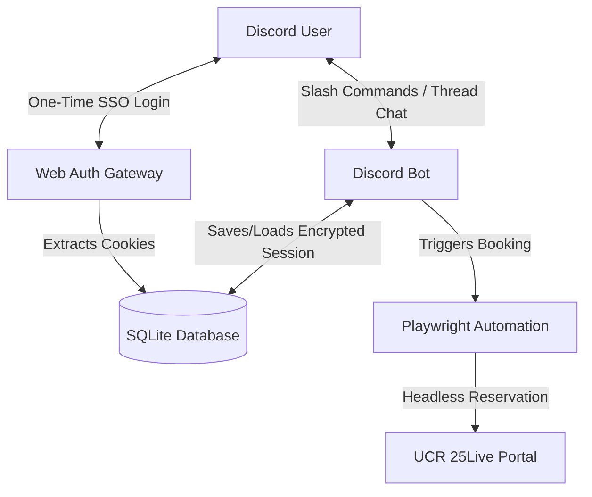

# Agent Spec: UCR 25Live Scheduling Discord Bot (Session Cache Architecture)

## Overview
This agent is a Discord bot designed to assist users in scheduling events at UCR. The bot operates in a dedicated, pre-existing Discord channel or thread. To bypass UCR Shibboleth / Duo MFA logins programmatically without storing NetID passwords, the bot implements a **Session Cookie Cache**. 

When a user requests to schedule an event (e.g., via `/schedule` or a message trigger), the bot checks if it has a valid, encrypted session cookie cache for that user. If not, it requests a one-time login. Once authenticated, the bot conversationally gathers all required scheduling fields in the Discord thread and automates the headless booking on the UCR 25Live portal (`reserve.ucr.edu`) using the cached session.

## Architecture & Session Flow

1. **One-Time Login:** When a member uses the bot for the first time (or after session expiry), the bot DMs them a secure link to a local/hosted Web Auth Gateway.
2. **Cookie Storage:** The user logs in to their UCR NetID normally (handling Duo MFA themselves). The Web Auth Gateway captures the active login session cookies, encrypts them using AES-256-GCM, and saves them in the SQLite database associated with the user's Discord ID.
3. **Headless Booking:** When the user schedules an event, the bot launches Playwright in headless mode, injects the user's cached session cookies, and automates the multi-step Event Wizard on `reserve.ucr.edu` without requiring user interaction.
4. **Proactive Refresh:** When the session expires (usually after 14 days), the bot DMs the member: *"Your session has expired. Please click this link to quickly re-authenticate."*

## Example Use Cases

### Scenario 1: Complete Booking Flow (With Active Session)
1. **User:** Types `/schedule` in the dedicated bot thread.
2. **Bot:** Verifies active session cache exists, then responds: *"Welcome! What is the internal Event Name you would like to schedule?"*
3. **User:** *"CS Club General Meeting"*
4. **Bot:** *"Great. What is the Event Title for Published Calendars?"*
5. **User:** *"UCR CS Club Inaugural Meeting"*
6. **Bot:** [Continues asking questions to collect all required fields...]
7. **Bot:** *"Gathered all details. Checking room availability for Winston Chung Hall 205..."*
8. **Bot:** [Playwright checks availability and takes a screenshot of the final preview page]
9. **Bot:** [Sends screenshot to thread] *"Here is the booking preview. Ready to finalize booking for 'CS Club General Meeting' on next Monday, 4 PM - 5 PM. Confirm?"*
10. **User:** *"Yes, please."*
11. **Bot:** [Playwright clicks submit] *"Successfully scheduled! Confirmation ID: UCR-987654."*

### Scenario 2: First-Time Login / Session Expired
1. **User:** Types `/schedule` in the thread.
2. **Bot:** Finds no active session and DMs the user: *"Please authenticate with your UCR NetID here to proceed: https://auth.ucr-bot.local/login?id=discord_user_id"*
3. **User:** Clicks link, logs in (performs Duo MFA), and sees: *"Authentication Successful! You can close this window."*
4. **Bot:** (In thread) *"Authentication successful! What is the internal Event Name you would like to schedule?"* (Continues conversation)

## Required Fields
The scheduling request **will not be submitted** unless 100% of these fields are collected and validated:
1. **Location:** Preferred building/room.
2. **Event Name:** Internal reference name.
3. **Event Title for Published Calendars:** Public-facing name.
4. **Event Description:** Detailed description.
5. **Event Type:** Category of the event.
6. **Primary Organization:** Sponsoring group or department.
7. **Expected Attendance:** Headcount (integer).
8. **Date and Time:** Starting and ending dates/times.
9. **Audiovisual Requirements:** Needed equipment (e.g. projector, microphone).
10. **Serving Food?** (Yes/No).
11. **Serving Beverages?** (Yes/No).
12. **Serving Alcohol?** (Yes/No).
13. **Who is attending the event?** Target audience.

## Tools Required

1. `get_user_session`
   - **Purpose:** Fetch the user's cached and encrypted session cookies from the database.
2. `check_room_availability`
   - **Purpose:** Launch Playwright with the user's cookies, navigate to 25Live, and check space availability.
3. `submit_25live_reservation`
   - **Purpose:** Launch Playwright, fill out the 25Live Event Wizard using the collected fields, and capture a booking preview screenshot or submit the reservation.

## Constraints & Safety Rules
- **100% Field Completion Gate:** No submission is allowed unless all 13 required fields are gathered.
- **Safety Approval Gate:** The bot must present a screenshot of the filled 25Live reservation preview page to the user in Discord and require explicit button click/confirmation before submitting.
- **Data Isolation:** A user's session cookies can only be decrypted and used for requests initiated by that specific Discord ID.
- **Secure Storage (Secure Agentic Coding):** NetID passwords are NEVER stored. Active session cookies are stored in a local SQLite database encrypted with AES-256-GCM. The encryption key is loaded only from environment variables.

## Success Criteria
- **Secure Cookie Decryption:** System fails securely if the database is read without the correct encryption key.
- **Accuracy:** Event details filled on 25Live match the user's inputs in Discord.
- **MFA Bypass Verification:** Success in booking headless sessions using 14-day cached cookies without triggering interactive login prompts.

## Reference Samples
- `core/python/cross-session-memory` — For maintaining context of the user's booking request across multiple Discord messages in a thread.

## Assumptions
1. **Credentials:** The user will configure the Discord Bot Token and Cookie Encryption Key in the `.env` file.
2. **Hosting:** For local prototyping, both the Discord bot and the Web Auth Gateway will run locally.
